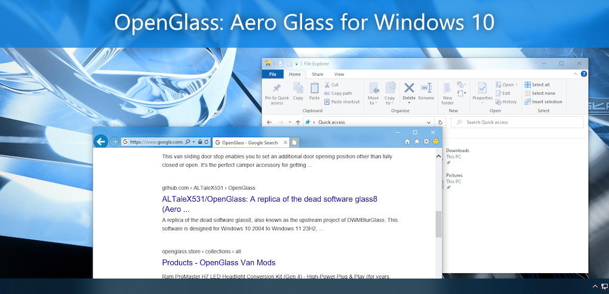

# Experience native look of Aero Glass interface on Windows 10+

This utility returns the full glass effect to the window frame like [glass8](http://www.msfn.org/board/forum/180-aero-glass-for-windows-8/), but with deeper control over blur, reflections, and theme integration.

## Supported Windows versions

- Windows 10 1809-22H2
- Windows 11 21H2-26H2
- Windows Server 2022

> [!IMPORTANT]
> **OpenGlass is not supported on Windows 11 26H1 or any versions with build 28000 and above.** Microsoft has removed the legacy MIL infrastructure in these builds, which makes it impossible for OpenGlass to continue supporting them. See [#260](https://github.com/ALTaleX531/OpenGlass/issues/260) for details.

> [!NOTE]
> OpenGlass only supports Windows builds from the General Availability channel. Builds from other channels (such as Canary, Dev, Release Preview and Beta) and Windows Server versions other than 2022 are **NOT supported**. Running on unsupported builds can crash DWM.

## Who should use OpenGlass?

OpenGlass is for advanced users who are comfortable editing the Windows registry and troubleshooting DWM. If you want a simpler option, try [DWMBlurGlass](https://github.com/Maplespe/DWMBlurGlass).

## Quick start

### Getting started

1. **Installation**: Download the latest Inno Setup package from [Releases](https://github.com/ALTaleX531/OpenGlass/releases) and follow the installer.
2. **Configuration**: Use the OpenGlass GUI or edit the [registry](#configuration) directly (manual registry edits require restarting OpenGlass or changing system color settings to apply).
3. **Reference**: Review the release notes and source code to stay informed about behavior changes and technical updates.

> [!TIP]
> **Emergency Exit**: Long press <kbd>Ctrl</kbd>+<kbd>Win</kbd>+<kbd>Shift</kbd>+<kbd>Q</kbd> to immediately terminate DWM if the system becomes unresponsive.

### Reporting issues

If you encounter crashes or technical bugs:

1. **Collect Dumps**: Follow the [WER guidelines](https://learn.microsoft.com/en-us/windows/win32/wer/collecting-user-mode-dumps) to enable user-mode crash dumps if DWM fails.
2. **Submit a Report**: Open a GitHub issue with your **Windows build**, **registry settings**, **steps to reproduce**, and **visual evidence** (screenshots/recordings) if necessary.

## Configuration

**Methods**: Use the OpenGlass GUI for convenience, or edit the registry directly for advanced control.

**Registry locations**:

- `HKEY_CURRENT_USER\SOFTWARE\Microsoft\Windows\DWM` (per-user, checked first)
- `HKEY_LOCAL_MACHINE\SOFTWARE\Microsoft\Windows\DWM` (system-wide fallback)

**Key inheritance**: Missing keys use predefined defaults. Variants (e.g., `XXXInactive`, `XXXMaximized`) inherit from their base key if not explicitly set. Keys with the `Override` suffix take precedence and resist resets by `uxtheme.dll` on Windows 10+.

## Registry reference

### Colorization settings

| Key Name | Type | Description |
| -------- | ---- | ----------- |
| ColorizationColor(Override) ColorizationColorInactive ColorizationAfterglow(Override) | DWORD | ARGB color used for the glass effect, alpha channel is ignored.  ℹ️ `ColorizationColorInactive` is only used when `GlassType` = 0x0 ℹ️ `ColorizationAfterglow(Override)` is only used when `GlassType` = 0x1 |
| ColorizationColorBalance(Override) ColorizationAfterglowBalance(Override) ColorizationBlurBalance(Override) | DWORD | Composition parameters for Windows 7 Aero effect shader.  ℹ️ Only used when `GlassType` = 0x1 |
| GlassOpacity GlassOpacityInactive | DWORD | The intensity of the color (0-100%). Default value is 63%.  ℹ️ Only used when `GlassType` = 0x0 |
| ColorizationColorCaption ColorizationColorCaptionInactive ColorizationColorCaptionMaximized ColorizationColorCaptionInactiveMaximized | DWORD | Color used for drawing window titles. Format is 0xBBGGRR.  <ul><li>0xFFFFFFFF = Determined by the system</li><li>0xFFFFFFFE = Read the `TEXTCOLOR` property from the current theme to obtain them.</li><li>0xFFFFFFFD = Automatically select the appropriate text colors based on `GlassType`. (default)</li></ul> |
| ColorizationOpaqueBlend | DWORD | Controls the transparency of glass effect (default = 0). |
| ColorizationBaseTransparent ColorizationBaseMaximized ColorizationBaseOpaque | DWORD | ARGB base color used for color blending.   <ul><li>0xFFFFFFFE = Automatically select the appropriate base color based on `GlassType` (default).</li><li>0xFFFFFFFF = Read the `COLORIZATIONCOLOR` property from the current theme to obtain them.</li></ul> |
| ColorizationOpaqueBlendPriority | DWORD | Behavior of choosing opaque blend base color.   <ul><li>0x0 = Windows Vista.</li><li>0x1 = Windows 7.</li><li>0xFFFFFFFF = Automatically select the appropriate behavior based on `GlassType` (default).</li></ul>ℹ️ For Windows Vista, `ColorizationBaseMaximized` is preferred, whereas for Windows 7 it is `ColorizationBaseOpaque`. |
| ColorizationOpacity ColorizationOpacityInactive ColorizationOpacityMaximized ColorizationOpacityInactiveMaximized | DWORD | (Additional) factors applied to glass color blending. (0%-100%).   <ul><li>0xFFFFFFFE = Automatically select the appropriate factors based on `GlassType`. (default).</li><li>0xFFFFFFFF = Read the `COLORIZATIONOPACITY` property from the current theme to obtain them.</li></ul> |

### Glass settings

| Key Name | Type | Description |
| -------- | ---- | ----------- |
| GlassType | DWORD | The type of glass effect.   <ul><li>0x0 = Windows Vista style blur (default).</li><li>0x1 = Windows 7 style blur.</li></ul> |
| GlassOverrideAccent | DWORD | Overrides accent blur surfaces with OpenGlass glass effects (e.g. the win10 taskbar). Default is 0. |
| CustomThemeReflection | String | Path to file with texture that is stretched over whole desktop and rendered above glass regions (default is Aero Glass Win7 reflection texture) |
| ColorizationGlassReflectionIntensity | DWORD | The overall multiplier applied to the intensity of reflection effect (0-100%). Default value is 0%.  opacity = base_opacity * intensity * 2 |
| ColorizationGlassReflectionOpacity ColorizationGlassReflectionOpacityInactive ColorizationGlassReflectionOpacityMaximized ColorizationGlassReflectionOpacityInactiveMaximized | DWORD | The base opacity of reflection effect (0-100%).   <ul><li>0xFFFFFFFE = Automatically select the appropriate factors based on `GlassType`. (default)</li><li>0xFFFFFFFF = Read the `OPACITY` property of `SQUEEGEREFLECTIONMAP` from the current theme to obtain them.</li></ul> |
| ColorizationGlassReflectionParallaxIntensity | DWORD | The parallax intensity of the reflection effect (e.g. when moving the windows side to side). Default value is 13%. |
| ColorizationGlassReflectionPolicy | DWORD | Controls where reflections should be rendered (default = 0xFFFFFFFF).   <ul><li>Titlebar = 1<<0</li><li>Aero Peek = 1<<2</li><li>Aero Snap = 1<<3 (ℹ️ Only effective in Win10)</li><li>Render everywhere if possible = 0xFFFFFFFF</li></ul> |
| BlurDeviation | DWORD | Standard deviation for gaussian blur, default = 30 (which means σ = 3.0)  Value 0 results in non-blurred transparency.  ℹ️ Only effective when `UseDirect3DRendering` = 0x0 |
| BlurOptimization | DWORD | Quality of gaussian blur  <ul><li>0x0 = Speed first (default)</li><li>0x1 = Balance</li><li>0x2 = Quality first</li></ul>  |
| RoundRectRadius | DWORD | The radius of glass geometry (default = 0), Win8=0, Win7=6 |
| CustomThemeMaterial | String | Path to file with texture that is rendered (tiled) above glass regions (default is Acrylic noise texture) |
| MaterialOpacity | DWORD | opacity of material texture (default = 0) |
| UseDirect3DRendering | DWORD | Set 1 to use d3d11 as glass renderer backend, and the blur radius is hardcoded to 3. (default = 0) |

### Theme settings

| Key Name | Type | Description |
| -------- | ---- | ----------- |
| CaptionButtons | DWORD | Changes caption buttons sizes, icon left margin and the opacity of the button glyphs.  <ul><li>0x0 = Vanilla style (default)</li><li>0x1 = Windows Vista style</li><li>0x2 = Windows 7 style</li><li>0x3 = Windows 8 style</li></ul> |
| CenterCaption | DWORD | Controls how title bar text is aligned.  <ul><li>0x0 = Keeps it on the left (default)</li><li>0x1 = Centers it between the titlebar icon and the titlebar buttons</li></ul> |
| TextGlowMode | DWORD | Specifies how window caption glow effect will be rendered   <ul><li>0x0 = No glow effect</li><li>0x1 = Glow effect loaded from atlas (default)</li><li>0x2 = Glow effect loaded from atlas and theme opacity is respected</li><li>0x3 = Composited glow effect using your theme settings HIWORD of the value specifies glow size (0 = theme default)</li></ul> |
| CustomThemeAtlas | String | Path to PNG file with theme resource (bitmap must have exactly the same layout as msstyle theme you are using!).   💡 OpenGlass also looks for a `.layout` file with the same name (e.g., `theme.png.layout`) to determine the layout of the atlas. |
| DisableModernBorders | DWORD | Disable modern rounded window borders.   <ul><li>0x0 = Enable modern borders (default)</li><li>0x1 = Disable modern borders</li></ul> ℹ️ Only effective in Win11 |

### Advanced settings

These settings are intended for `HKLM` and should only be modified if necessary.

> [!CAUTION]
> Do not modify this section unless you fully understand the impact.

| Key Name | Type | Description |
| -------- | ---- | ----------- |
| DisableGlassOnBattery | DWORD | <ul><li>0x1 = When energy saver is on then the glass effect will be opaque to decrease energy consumption (default)</li><li>0x0 = glass effect won't be opaque on energy saver</li></ul> |
| DisabledHooks | DWORD | Controls which module's hooks are disabled, which will also control the availability of features.   <ul><li>0x0 = No hooks are disabled (default)</li><li>0x1 = Disables hooks for [CaptionTextHandler.cpp](OpenGlass/CaptionTextHandler.cpp)</li><li>0x2 = Disables hooks for [AccentOverrider.cpp](OpenGlass/AccentOverrider.cpp)</li><li>0x4 = Disables hooks for [GlassFrameHandler.cpp](OpenGlass/GlassFrameHandler.cpp)</li><li>0x8 = Disables hooks for [GlassReflectionHandler.cpp](OpenGlass/GlassReflectionHandler.cpp)</li><li>0x10 = Disables hooks for [CaptionMetricsTweaker.cpp](OpenGlass/CaptionMetricsTweaker.cpp)</li></ul> ⚠️ Should only be used to maintain compatibility with third-party applications. |
| GlassSafetyZoneMode | DWORD | Set 0 to disable glass safety zone. (default = 1) |

## Credits

### [Banner for OpenGlass](https://github.com/ALTaleX531/OpenGlass/discussions/11)

Provided by [@aubymori](https://github.com/aubymori).
Wallpaper: [metalheart jawn #2](https://www.deviantart.com/kfh83/art/metalheart-jawn-2-1068250045) by [@kfh83](https://github.com/kfh83).

### [[MS-RDPCR2]: Remote Desktop Protocol: Composited Remoting V2](https://learn.microsoft.com/en-us/openspecs/windows_protocols/ms-rdpcr2)

Specifies the Remote Desktop Protocol: Composited Remoting V2, which displays the contents of the Windows-based desktop running on one machine on a second machine connected to the first via a network.

### [KNSoft.SlimDetours](https://github.com/KNSoft/KNSoft.SlimDetours)

SlimDetours is an improved Windows API hooking library base on Microsoft Detours.

### [VC-LTL - An elegant way to compile lighter binaries.](https://github.com/Chuyu-Team/VC-LTL5)

VC-LTL is an open source CRT library based on the MS VCRT that reduce program binary size and say goodbye to Microsoft runtime DLLs, such as msvcr120.dll, api-ms-win-crt-time-l1-1-0.dll and other dependencies.

### [Windows Implementation Libraries (WIL)](https://github.com/Microsoft/wil)

The Windows Implementation Libraries (WIL) is a header-only C++ library created to make life easier for developers on Windows through readable type-safe C++ interfaces for common Windows coding patterns.

### [libvalinet](https://github.com/valinet/libvalinet)

A header-only collection of generic implementations shared between multiple projects.

OpenGlass borrowed its symbol download feature.

### [TranslucentTB](https://github.com/TranslucentTB/TranslucentTB)

A lightweight utility that makes the Windows taskbar translucent/transparent.

OpenGlass borrowed its C++ project structure.

## Development build

### Prerequisites

- **Visual Studio 2026** with C++ desktop development workload
- **vcpkg**: main C++ dependencies (wxwidgets, wil, knsoft-slimdetours) are pulled via vcpkg. Auxiliary packages (VC-LTL, SourceLink) come from NuGet.

### Building

1. Run `vcpkg integrate install` so dependencies are picked up automatically by MSBuild.
2. Open `OpenGlass.slnx` in Visual Studio.
3. Select the `Release` configuration and press `F5`.

> [!TIP]
> **InnoSetup is not required.** You may see errors related to the installer project during build. These do not block compilation and DLLs/executables are still produced.

### ReleaseSigned configuration

Official releases use the `ReleaseSigned` configuration. This configuration uses macros to prevent digital signature from being abused. **Do not mix `ReleaseSigned` binaries with plain `Release` binaries**. Signed and unsigned components are not compatible. If you compile with the plain `Release` configuration, some features may behave differently when loaded alongside official signed DLLs.

## Maintaining offset tables

OpenGlass reads internal `dwmcore.dll` and `uDWM.dll` struct members via hardcoded byte offsets that change between Windows builds. When a new build arrives, these offsets must be updated.

### Automated update (LLM-driven)

Two 7-phase skills methodically extract all offsets from IDA Pro. Each offset struct in the `.Offsets.hpp` files has inline comments documenting the verification function and pseudocode pattern.

**Setup**: Install the [ida-pro-mcp](https://github.com/mrexodia/ida-pro-mcp) MCP server to connect Claude Code to IDA Pro.

1. Open the new DLL in IDA Pro, wait for auto-analysis, then select **Edit** > **Plugins** > **MCP** to activate the plugin
2. Run `/extract-dwmcore-offsets` or `/extract-udwm-offsets` in Claude Code
3. Review the Phase 7 report: verify changed/removed/not-verified offsets against the binary, then either let Claude Code apply the edits or manually update [dwmcoreProjection.Offsets.hpp](OpenGlass/dwmcoreProjection.Offsets.hpp) / [uDwmProjection.Offsets.hpp](OpenGlass/uDwmProjection.Offsets.hpp)

### Manual update

If IDA Pro is not available, locate the accessor functions named in each offset struct's comment (see `.Offsets.hpp` files) using a disassembler, find the member-accessing instructions, and read the displacement bytes.

## Support

OpenGlass is developed in my free time and distributed under the GPLv3 license.

As DWM does not officially support extensibility, OpenGlass relies on undocumented techniques. While designed for stability and performance, future Windows updates may cause breakage. Efforts will be made to maintain functionality, but continuous support cannot be guaranteed.

If you find OpenGlass valuable, please consider supporting the project via Ko-fi. By donating, you agree that:

- Your donation is voluntary without expectation of consideration.
- You donate as a natural person.

